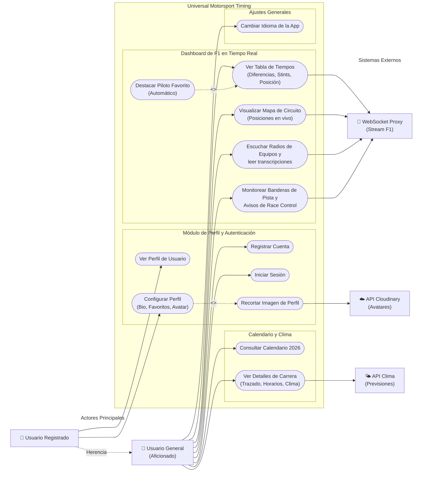

# 🏎️ Universal Motorsport Timing
*Ecosistema de telemetría de alta frecuencia (Web) y gestión de calendario F1 (Android)*

### Índice
- [🏎️ Universal Motorsport Timing](#️-universal-motorsport-timing)
    - [Índice](#índice)
    - [1. Personas del Proyecto](#1-personas-del-proyecto)
    - [2. Descripción del Proyecto](#2-descripción-del-proyecto)
      - [Plataforma Web: Live Timing](#plataforma-web-live-timing)
      - [App Android: Universal Motorsport Timing Calendar (UMTC)](#app-android-universal-motorsport-timing-calendar-umtc)
      - [Capturas de pantalla](#capturas-de-pantalla)
      - [Stack tecnológico](#stack-tecnológico)
    - [3. Aportación por Módulos](#3-aportación-por-módulos)
    - [4. Repositorios de Código](#4-repositorios-de-código)
    - [5. Artefactos en Producción](#5-artefactos-en-producción)
    - [6. Documentación e Infraestructura](#6-documentación-e-infraestructura)
    - [7. Gestión del Proyecto (Jira)](#7-gestión-del-proyecto-jira)
    - [8. Documentación de Código (Compodoc)](#8-documentación-de-código-compodoc)

---

### 1. Personas del Proyecto
| Nombre completo | Rol en el proyecto |
| ------ | ------ |
| **Guillermo Diáñez Gómez** | Desarrollador Fullstack / Arquitecto de Android & Telemetría |

---

### 2. Descripción del Proyecto
**Universal Motorsport Timing** es una solución integral para aficionados a la Fórmula 1 que combina el procesamiento de datos en tiempo real con una herramienta de gestión de temporada móvil.

#### Plataforma Web: Live Timing
Un dashboard interactivo de "segunda pantalla" que procesa streams en vivo de alta frecuencia de F1. 
*   **Tabla de Tiempos Interactiva:** Clasificación en vivo con intervalos (Gap/Interval) e historiales de neumáticos (stints).
*   **Mapa del Circuito Dinámico:** Canvas interactivo que posiciona monoplazas mediante coordenadas bidimensionales (X, Y) y algoritmos de interpolación.
*   **Comunicaciones por Radio:** Reproducción de audios de transmisiones entre pilotos y boxes en tiempo real.

#### App Android: Universal Motorsport Timing Calendar (UMTC)
Aplicación nativa construida con tecnologías modernas para el seguimiento del calendario de F1.
*   **Pantallas Principales:** Lista de carreras, detalle expandido con cronograma de sesiones (timeline visual) e inicio de sesión.
*   **Funcionalidades Avanzadas:** 
    *   **Gestión de Zonas Horarias:** Conversión automática de horas UTC a la hora local del dispositivo.
    *   **Integración de Clima:** Previsiones meteorológicas en tiempo real para cada sesión mediante la API de Open-Meteo.
    *   **Sistema de Banderas Dinámico:** Carga de banderas desde CDN para optimizar el tamaño del APK.
    *   **Multimedia:** Uso de CameraX para capturar fotos de carreras y acceso a la galería mediante MediaStore.

#### Capturas de pantalla

  
  &nbsp;&nbsp;&nbsp;&nbsp;
  

#### Stack tecnológico
| Capa | Tecnología |
| ------ | ------ |
| **Frontend Web** | Angular 17+, RxJS, Signals, Angular Material |
| **App Móvil** | Kotlin, Jetpack Compose, Material Design 3, Hilt, Room, Coroutines |
| **Backend / Proxy** | Node.js, Express, WebSockets, Pako (descompresión binaria) |
| **APIs & Servicios** | F1 SignalR, Open-Meteo, Cloudinary, Retrofit & Gson |

```mermaid 
flowchart TD
    %% Universal Motorsport Timing Architecture Diagram
    %% Tokyo Night / Dracula theme friendly

    classDef client fill:#1a1b26,stroke:#7aa2f7,stroke-width:2px,color:#c0caf5;
    classDef broker fill:#1f2335,stroke:#bb9af7,stroke-width:2px,color:#c0caf5;
    classDef services fill:#16161e,stroke:#9ece6a,stroke-width:2px,color:#c0caf5;
    classDef highlight fill:#f7768e,stroke:#db4b4b,stroke-width:2px,color:#ffffff;

    subgraph Client ["FRONTEND (Angular 17 Client & SSR)"]
        A["Angular 17 SPA<br>(Client-Side & SSR)"]:::client
        B["Angular Material & CDK<br>(UI Components)"]:::client
        C["Syncfusion EJ2 Suite<br>(Grids, Charts, Layouts)"]:::client
        D["Chart.js<br>(Interactive Telemetry)"]:::client
        E["ngx-translate<br>(Internationalization i18n)"]:::client
        F["RxJS & Angular Signals<br>(Reactive State Management)"]:::client
    end

    subgraph Broker ["WEBSOCKET PROXY / BROKER (Node.js - Railway)"]
        G["Node.js + Express App"]:::broker
        H["WebSocket Server ('ws')<br>(Multi-client broadcast)"]:::broker
        I["pako (Zlib Inflate)<br>(Decompresses F1 '.z' streams)"]:::broker
        J["http-proxy-middleware<br>(API Proxy & Header Spoofing)"]:::broker
    end

    subgraph External ["EXTERNAL SERVICES & APIs"]
        K["F1 Live Timing SignalR<br>(livetiming.formula1.com)"]:::services
        L["MotoGP API Gateway<br>(api.motogp.pulselive.com)"]:::services
        M["Cloudinary API<br>(Profile Images)"]:::services
        N["JWT Auth Server (Vercel)<br>(node-server-ut-lq2p)"]:::services
    end

    %% Interactions
    A --- B
    A --- C
    A --- D
    A --- E
    A --- F

    %% Client communication flows
    A <-->|"WS Connections"| H
    A -->|"HTTP Request Proxy"| J
    A -->|"User Profile Images"| M
    A -->|"JWT Authentication"| N

    %% Broker internal flow
    G === H
    G === I
    G === J

    %% Broker external integration
    H <-->|"SignalR connection<br>(User-Agent: BestHTTP)"| K
    J -->|"Forwarded requests<br>(Origin / Referer headers)"| L
```

---

### 3. Aportación por Módulos

| Módulo | Profesor/a | Aportación en Universal Motorsport |
| :--- | :--- | :--- |
| **Acceso a datos** | Juan Antonio García Gómez | Persistencia local en Android mediante **Room Database** y gestión de perfiles con **Cloudinary** para avatares. |
| **Programación multimedia y dispositivos móviles** | David Hormigo Ramírez | Implementación de **CameraX** y **MediaStore** en Android, y sistema de reproducción de **Team Radios** en la web. |
| **Programación de servicios y procesos** | David Hormigo Ramírez | Consumo de APIs REST con **Retrofit** y gestión de flujos reactivos con **StateFlow**. Descompresión binaria en tiempo real (Pako). |
| **Desarrollo de interfaces** | Carmen Campos Fernández | UI declarativa con **Jetpack Compose** y **Material Design 3**. Uso de **OnPush** en Angular para alto rendimiento (60 FPS). |
| **Servidores y APIs** | Juan Antonio García Gómez | Creación del **Broker de Telemetría** en Node.js para negociar con servidores SignalR y eludir restricciones de CORS. |
| **Sistemas de gestión empresarial.** | Miguel Ángel Ronda Carracao | Sincronización de calendarios oficiales de la temporada 2026 y gestión de cronogramas de sesiones. |

---

### 4. Repositorios de Código
| Repositorio | Descripción | Enlace |
| ------ | ------ | ------ |
| **Web Frontend** | Aplicación Angular de Telemetría | [Enlace al Repo](https://github.com/therabbithd/UniversalMotorsportTiming) |
| **Android App (UMTC)** | Aplicación Nativa Kotlin/Compose | [Enlace al Repo Android](https://github.com/therabbithd/Calendariof1android) |
| **Telemetry Broker** | Servidor Proxy de Datos | [Enlace al Repo](https://github.com/therabbithd/f1-websocket-proxy) |
| **node-server-ut** |Servidor de autenticación | [Enlace al Repo](https://github.com/therabbithd/node-server-ut) |
| **users-dashboard** |Dashboard con estadisticas de usuarios | [Enlace al Repo](https://github.com/therabbithd/users-dashboard) |
| **api-dashboard-pandas** |api con los datos que usa el dashboard hecho con panda y fast api | [Enlace al Repo](https://github.com/therabbithd/api-dashboard-pandas) |

---

### 5. Artefactos en Producción
| Artefacto | URL / Acceso |
| ------ | ------ |
| **Aplicación Web** | [Enlace](https://universal-motorsport-timing.vercel.app/) |
| **App Android (APK)** | [Enlace a descarga de APK en Releases](https://github.com/therabbithd/Calendariof1android/releases/) |
| **Dashboard** | [Enlace](https://users-dashboard-peach.vercel.app/login) |
| **API Dashboard** | [API](api-dashboard-pandas.vercel.app) |
| **Servidor de Autenticación** | [API](https://node-server-ut-lq2p.vercel.app/) |
| **Credenciales** | **User:** admin@showcase.com/ **Pass:** 12345689 (mín. 8 caracteres) |

---

### 6. Documentación e Infraestructura
*   **Arquitectura:** Sigue principios de **Clean Architecture** y **MVVM** en la parte móvil (UI, Domain, Data layers).
*   **PDF Unificado:** [Enlace ](./sources/docs/merged.pdf)
*   **Diagrama de casos de uso**

---

### 7. Gestión del Proyecto (Jira)
La planificación se ha gestionado mediante **Jira**, organizando el trabajo en **Tareas** y **Subtareas** en un tablero Kanban.
*   [Resumen de Gestión en Jira (Markdown)](./sources/docs/RESUMEN-JIRA-UMT.md) (Incluye estadísticas y tablero final).
*   [Resumen de Gestión en Jira (PDF)](./sources/docs/RESUMEN-JIRA-UMT.pdf)

---

### 8. Documentación de Código (Compodoc)
Toda la lógica de Angular y servicios está documentada siguiendo estándares profesionales.
*   **Servidor Compodoc:** [Compodoc](https://universal-motorsport-timing-ap1n.vercel.app/)

