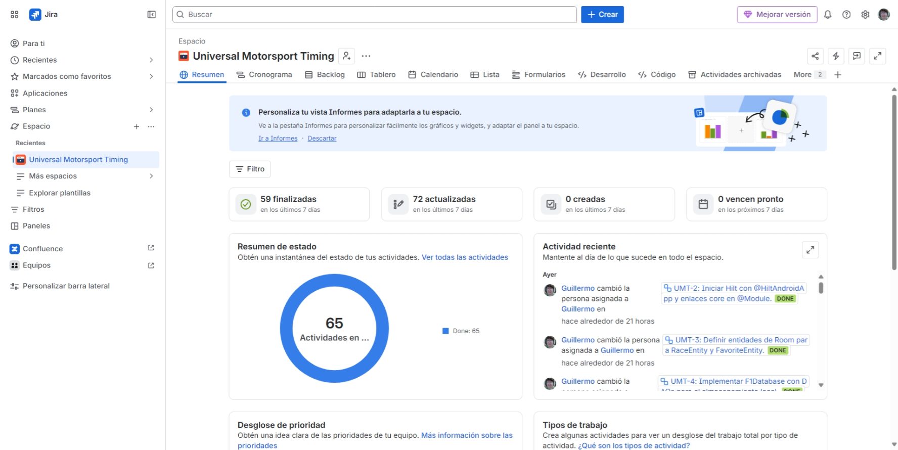
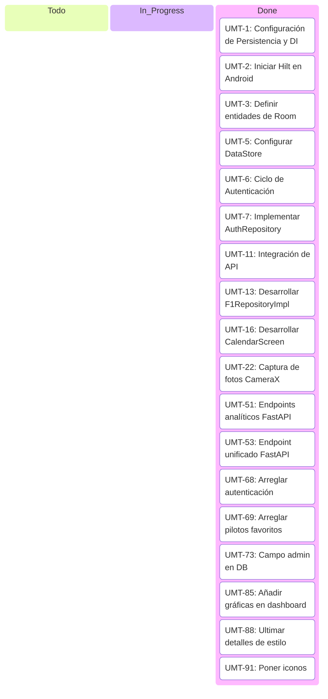

# 🏎️ Memoria de Gestión del Proyecto en Jira
**2DAM | Curso 2025/26**  
**Proyecto:** Universal Motorsport Timing (UMT)  
**Autor:** Guillermo Diáñez Gómez  

---

## Índice
- [🏎️ Memoria de Gestión del Proyecto en Jira](#️-memoria-de-gestión-del-proyecto-en-jira)
  - [Índice](#índice)
  - [1. Introducción al proyecto](#1-introducción-al-proyecto)
  - [2. Resumen global](#2-resumen-global)
  - [3. Tablero Kanban del proyecto](#3-tablero-kanban-del-proyecto)
  - [4. Estadísticas del proyecto](#4-estadísticas-del-proyecto)
    - [4.1. Por tipo de incidencia](#41-por-tipo-de-incidencia)
    - [4.2. Por estado](#42-por-estado)
    - [4.3. Por responsable](#43-por-responsable)
  - [5. Ejemplo de Tarea (Hitos de Desarrollo)](#5-ejemplo-de-tarea-hitos-de-desarrollo)
    - [`UMT-1: Configuración de Persistencia y DI`](#umt-1-configuración-de-persistencia-y-di)
  - [6. Ejemplo de Subtarea (Detalle de Implementación)](#6-ejemplo-de-subtarea-detalle-de-implementación)
    - [`UMT-91: poner iconos`](#umt-91-poner-iconos)
  - [7. Tareas y Subtareas](#7-tareas-y-subtareas)
    - [7.1. Ejemplos de Tareas en Jira](#71-ejemplos-de-tareas-en-jira)
    - [7.2. Ejemplos de Subtareas en Jira](#72-ejemplos-de-subtareas-en-jira)
  - [8. Foto resumen de Jira actualmente](#8-foto-resumen-de-jira-actualmente)
  - [9. Conclusión](#9-conclusión)

---

## 1. Introducción al proyecto
Este documento detalla de manera ordenada y estructurada la gestión del proyecto **Universal Motorsport Timing (UMT)** en la plataforma **Jira**. 

**Universal Motorsport Timing** es un ecosistema integral enfocado en la Fórmula 1 que consta de:
* Un dashboard web interactivo para telemetría en tiempo real de alta frecuencia (*Live Timing*).
* Una aplicación móvil nativa Android para el seguimiento y consulta del calendario oficial de F1.
* Un proxy intermedio de telemetría (*Telemetry Broker*) en Node.js y un backend de analíticas en FastAPI.

Para asegurar un desarrollo ágil y ordenado, el proyecto se ha planificado y estructurado en **Jira** mediante un tablero **Kanban**, dividiendo las funcionalidades en **Tareas** (que actúan como historias/hitos de funcionalidad principal) y **Subtareas** (que representan los pasos y detalles técnicos de desarrollo).

* **Enlace a Jira:** [Jira - Proyecto UMT](https://pagui1112.atlassian.net/jira/software/projects/UMT/boards/1)

---

## 2. Resumen global
La gestión en Jira ha permitido planificar de forma secuencial y estructurada las siguientes áreas clave:
1. **Configuración de Persistencia e Inyección de Dependencias (DI):** Inicialización de Room y Hilt en la app móvil.
2. **Ciclo de Autenticación:** Registro y login de usuarios con gestión de sesiones en local y API.
3. **Integración de APIs de F1 y Clima (OpenMeteo):** Soporte offline (Network-Bound Resource).
4. **Pantallas y Componentes de Calendario:** Visualización del cronograma, cálculo de husos horarios y mapas.
5. **Integración Multimedia:** Captura con CameraX y subida de imágenes a Cloudinary.
6. **Endpoints de Analíticas con Pandas y FastAPI:** Visualización estadística de usuarios en el dashboard.
7. **Documentación:** Generación de modelos de datos, servicios, API y Compodoc.

---

## 3. Tablero Kanban del proyecto
A continuación, se detalla el estado global del backlog de incidencias del proyecto en Jira (fecha de corte: `03/06/2026`):

| Estado | Incidencias | % del Total |
| :--- | :---: | :---: |
| **Finalizada / Finalizado** (Done) | 84 | 100.0% |
| **En curso** (In Progress) | 0 | 0.0% |
| **Tareas por hacer** (To Do) | 0 | 0.0% |
| **Total** | **84** | **100%** |

---

## 4. Estadísticas del proyecto

### 4.1. Por tipo de incidencia
Al tratarse de un proyecto unipersonal estructurado de forma práctica, las incidencias se han dividido en tareas principales que engloban las historias del producto y subtareas que detallan el código.

| Tipo | Cantidad |
| :--- | :---: |
| Tarea | 20 |
| Subtarea | 64 |
| **Total** | **84** |

### 4.2. Por estado
| Estado | Cantidad |
| :--- | :---: |
| Finalizada / Finalizado | 84 |
| Tareas por hacer | 0 |
| **Total** | **84** |

### 4.3. Por responsable
| Responsable | Incidencias |
| :--- | :---: |
| Guillermo Diáñez Gómez | 84 |
| Sin asignar (Subtareas) | 0 |
| **Total** | **84** |

---

## 5. Ejemplo de Tarea (Hitos de Desarrollo)
Las tareas principales sirven como los contenedores de las funcionalidades requeridas.

### `UMT-1: Configuración de Persistencia y DI`

| Campo | Valor |
| :--- | :--- |
| **Clave** | UMT-1 |
| **Tipo** | Tarea |
| **Estado** | Finalizada |
| **Prioridad** | Medium |
| **Asignado** | Guillermo |
| **Informador** | Guillermo |
| **Creada** | 2026-03-19 |

> **Descripción:** Configuración inicial de la arquitectura del lado móvil Android, estableciendo el framework de inyección de dependencias con Hilt y las bases de datos locales con Room.

---

## 6. Ejemplo de Subtarea (Detalle de Implementación)
Las subtareas son componentes concretos de código.

### `UMT-91: poner iconos`

| Campo | Valor |
| :--- | :--- |
| **Clave** | UMT-91 |
| **Tipo** | Subtarea |
| **Estado** | Finalizada |
| **Prioridad** | Medium |
| **Asignado** | Guillermo |
| **Informador** | Guillermo |
| **Creada** | 2026-05-21 |

> **Descripción:** Incluir los iconos de interfaz de usuario necesarios en la aplicación móvil y web para las secciones de telemetría y configuración del perfil.

---

## 7. Tareas y Subtareas

### 7.1. Ejemplos de Tareas en Jira
* **UMT-1:** Configuración de Persistencia y DI
* **UMT-6:** Ciclo de Autenticación
* **UMT-11:** Integración de API y Repositorio
* **UMT-51:** Implementación y optimización de endpoints analíticos con FastAPI y Pandas
* **UMT-57:** Configuración de Seguridad e Integración del Backend de la API
* **UMT-62:** Procesamiento de Métricas y Desarrollo de Endpoints con Pandas

### 7.2. Ejemplos de Subtareas en Jira
* **UMT-2:** Iniciar Hilt con `@HiltAndroidApp` y enlaces core en `@Module` (dentro de UMT-1).
* **UMT-3:** Definir entidades de Room para `RaceEntity` y `FavoriteEntity` (dentro de UMT-1).
* **UMT-7:** Implementar `AuthRepository` con funciones de login y registro (dentro de UMT-6).
* **UMT-8:** Construir `LoginScreen` y `RegisterScreen` usando Jetpack Compose (dentro de UMT-6).
* **UMT-53:** Desarrollar endpoint unificado `/api/dashboard/all` (dentro de UMT-51).
* **UMT-54:** Implementar distribución de dominios de correo electrónico `/api/dashboard/domains` (dentro de UMT-51).

---

## 8. Foto resumen de Jira actualmente
A continuación se muestra una representación visual del flujo de trabajo dentro del tablero Kanban de Jira:

---

## 9. Conclusión
La gestión y planificación del proyecto **Universal Motorsport Timing** a través de **Jira** ha proporcionado un entorno controlado y secuencial para abordar un desarrollo fullstack robusto. 

La organización mediante **Tareas** como hitos principales y **Subtareas** para detalles de código ha facilitado:
* Visualizar en todo momento la carga de trabajo pendiente del proyecto.
* Dividir un desarrollo complejo (Web, Móvil, Backend) en incrementos manejables y testeables.
* Realizar un seguimiento transparente de los avances e incidencias solucionadas durante el ciclo de desarrollo.

Se recomienda firmemente el uso de metodologías ágiles asistidas por herramientas como **Jira** para estructurar proyectos de desarrollo de software, ya que garantizan la trazabilidad del software desde la planificación hasta el despliegue final.
